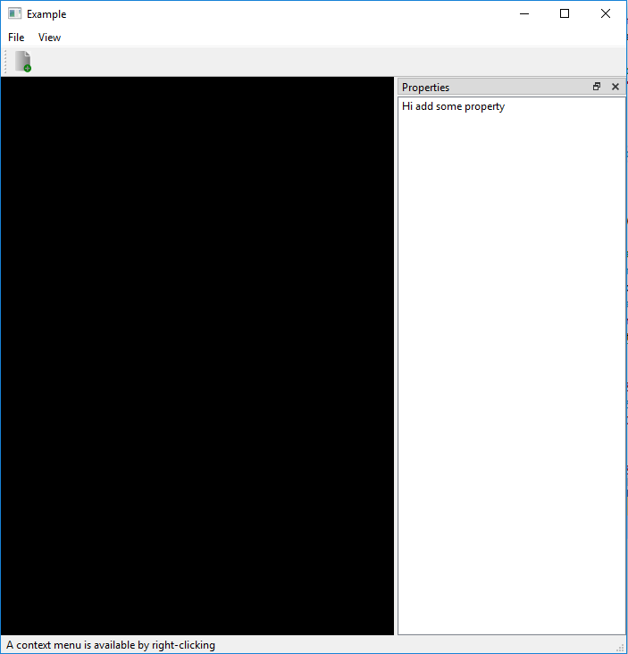

# OpenGLnQT

Integrating OpenGL and Qt5:
  1) Qt5 is used for window and widgets
  2) OpenGL is used for rendering (glew is used here not QtOpenGL)
  
Output Image:

References:
1) https://doc.qt.io/qt-5/qtwidgets-mainwindows-application-example.html
2) https://doc.qt.io/qt-5/qtopengl-hellogl2-example.html#
